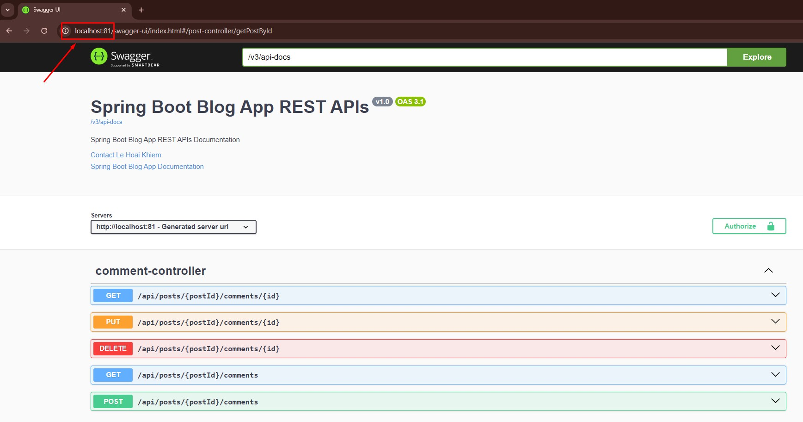
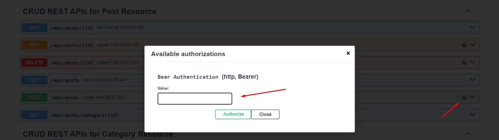
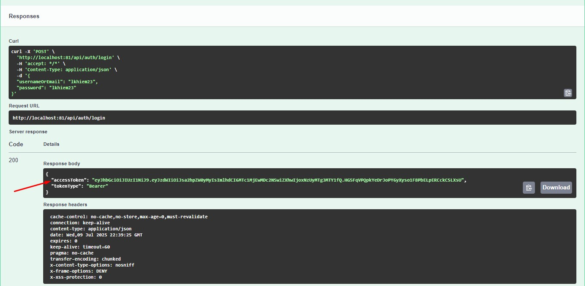
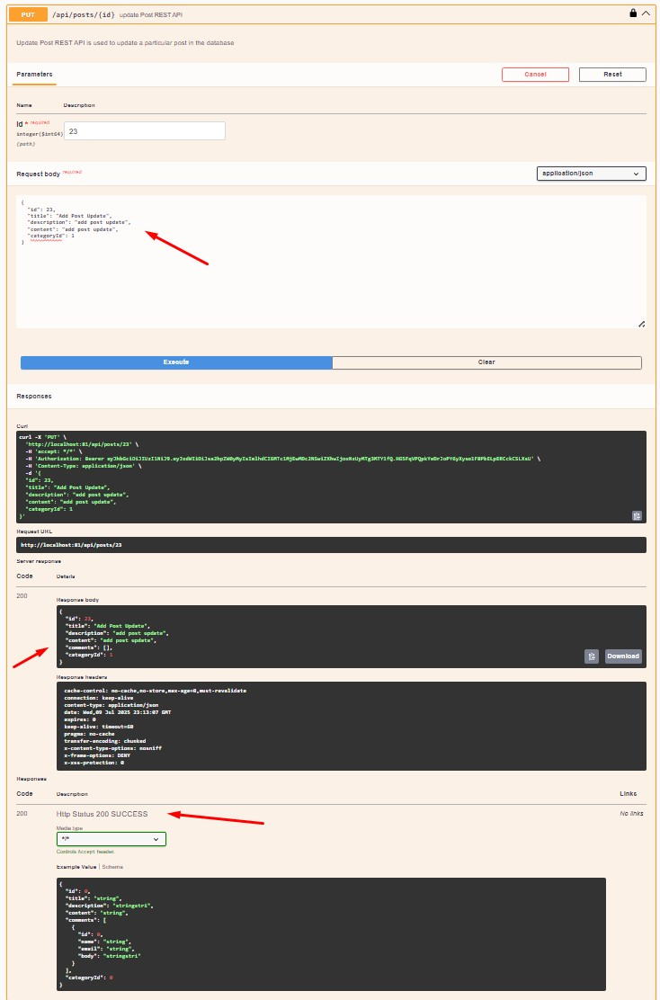
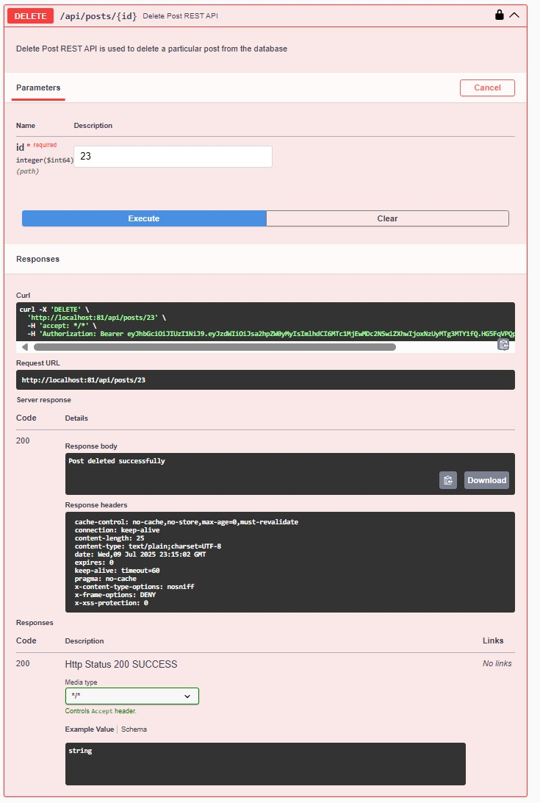

# 📰 Blog RESTful API with Spring Boot

A full-featured **Blog RESTful API** built with **Java Spring Boot 3**, supporting JWT-based authentication, CRUD for posts, categories, comments, validation, exception handling, and OpenAPI documentation. The application is fully **Dockerized** with support for **Docker Compose**.

---

## ✅ Features

- 🔐 JWT Authentication & Authorization
- 📝 CRUD operations for Posts
- 📁 Category Management
- 💬 Comment System
- 👤 User Registration & Login
- ⚠️ Global Exception Handling
- ✅ Input Validation using Hibernate Validator
- 📚 API Documentation with SpringDoc OpenAPI
- 🐳 Docker & Docker Compose support
- 📂 SQL file for quick database setup
- 📬 Postman Collection for testing

---

## 🛠️ Tech Stack

| Technology         | Description                      |
|--------------------|----------------------------------|
| Java               | Version 22                       |
| Spring Boot        | Version 3.5.3                    |
| Spring Security    | Version 6                        |
| Spring Data JPA    | ORM for database interaction     |
| MySQL              | Relational database              |
| JWT                | Token-based authentication       |
| SpringDoc OpenAPI  | Swagger UI for API documentation |
| Maven              | Project management tool          |
| Docker             | Containerization                 |
| Docker Compose     | Multi-container orchestration    |

---

## 📸 Screenshots
Swagger UI

1. Docker

2. Auth Header

3. Login (Token)

5. Update Post (Authorize)

6. Delete Post (Authorize)

